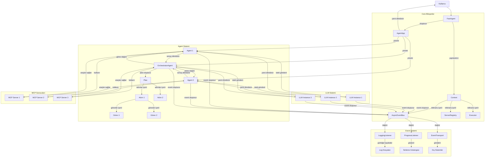

# Fast-Agent Sistem Akış Diyagramı

Bu belge, Fast-Agent sisteminin temel bileşenlerini ve aralarındaki etkileşimleri detaylı olarak açıklamaktadır. Sistem akışı, agent'ların nasıl oluşturulduğunu, event sisteminin nasıl çalıştığını ve orchestrator'ların nasıl görev dağıtımı yaptığını göstermektedir.

## 1. Sistem Bileşenleri

### 1.1 FastAgent

FastAgent, sistemin ana giriş noktasıdır. Kullanıcılar bu sınıf aracılığıyla agent'lar oluşturur ve yapılandırır. FastAgent, dekoratörler aracılığıyla farklı agent türlerini (temel agent, orchestrator, router, chain, parallel, evaluator-optimizer) tanımlamayı sağlar.

### 1.2 Agent

Agent, LLM (Large Language Model) ile etkileşime giren ve belirli görevleri yerine getiren temel birimdir. Her agent'ın bir adı, talimatları ve bağlı olduğu MCP sunucuları vardır. Agent'lar, kullanıcı mesajlarını alır, LLM'e iletir ve yanıtları döndürür.

### 1.3 Orchestrator

Orchestrator, karmaşık görevleri yönetmek için birden fazla agent'ı koordine eden özel bir agent türüdür. İki planlama moduna sahiptir:

- **Full Planning**: Tüm görevi başlangıçta planlar ve adım adım yürütür
- **Iterative Planning**: Görevi aşamalı olarak planlar ve her adımda yeniden değerlendirir

### 1.4 Event Sistemi

Event sistemi, sistem genelinde olayları izlemek, günlüğe kaydetmek ve ilerleyişi raporlamak için kullanılır. AsyncEventBus, olayları dinleyicilere ve transport'lara dağıtır. Event'ler debug, info, warning, error ve progress gibi türlere sahiptir.

### 1.5 Context

Context, uygulama genelinde paylaşılan global durumu saklar. Yapılandırma, executor, server registry ve diğer önemli bileşenlere referanslar içerir.

## 2. Sistem Akışı

### 2.1 Uygulama Başlatma

1. Kullanıcı, FastAgent sınıfını kullanarak bir uygulama oluşturur
2. Komut satırı argümanları işlenir (model seçimi, agent seçimi vb.)
3. Yapılandırma dosyaları yüklenir (fastagent.config.yaml)
4. Event sistemi başlatılır ve dinleyiciler kaydedilir
5. Context nesnesi oluşturulur ve yapılandırılır

### 2.2 Agent Tanımlama

1. Kullanıcı, dekoratörler aracılığıyla agent'ları tanımlar (@fast.agent, @fast.orchestrator vb.)
2. Her dekoratör, agent yapılandırmasını (ad, talimat, sunucular, model vb.) saklar
3. Dekoratörler, işlev üzerinde metadata olarak saklanır ve daha sonra FastAgent tarafından işlenir

### 2.3 Agent Oluşturma

1. FastAgent.run() çağrıldığında, dekoratörlerden agent yapılandırmaları toplanır
2. Agent'lar bağımlılık sırasına göre oluşturulur
3. Her agent için:
   - Agent nesnesi oluşturulur (Agent, OrchestratorAgent vb.)
   - LLM bağlanır ve yapılandırılır
   - MCP sunucuları bağlanır
   - Agent, AgentApp nesnesine eklenir

### 2.4 Agent Çalıştırma

1. Kullanıcı, agent'a bir mesaj gönderir (await agent("mesaj"))
2. Mesaj, PromptMessageMultipart'a dönüştürülür
3. Agent, mesajı LLM'e iletir
4. LLM, mesajı işler ve yanıt üretir
5. Yanıt, kullanıcıya döndürülür

### 2.5 Orchestrator Akışı

1. Kullanıcı, orchestrator'a bir görev gönderir
2. Orchestrator, görevi analiz eder ve bir plan oluşturur (Plan nesnesi)
3. Plan, adımlardan (Step) ve görevlerden (Task) oluşur
4. Her adım için:
   - Adımdaki görevler belirlenir
   - Her görev için uygun agent seçilir
   - Görevler agent'lara dağıtılır ve sonuçlar toplanır
   - Adım sonuçları birleştirilir
5. Tüm adımların sonuçları sentezlenir ve final yanıt oluşturulur

### 2.6 Event İşleme

1. Sistem genelinde olaylar (event'ler) oluşturulur
2. Event'ler, AsyncEventBus'a gönderilir
3. AsyncEventBus, event'leri tüm dinleyicilere dağıtır
4. Dinleyiciler, event'leri işler (günlüğe kaydetme, ilerleme gösterme vb.)
5. Event'ler, yapılandırılmış transport'lar aracılığıyla dış sistemlere gönderilebilir

## 3. Veri Akışı

### 3.1 Kullanıcı Girişi → Agent

1. Kullanıcı, agent'a bir mesaj gönderir
2. Mesaj, string'den PromptMessageMultipart'a dönüştürülür
3. PromptMessageMultipart, LLM'e iletilir

### 3.2 Agent → LLM

1. Agent, PromptMessageMultipart'ı LLM'e iletir
2. LLM, mesajı işler ve yanıt üretir
3. Yanıt, PromptMessageMultipart olarak agent'a döndürülür

### 3.3 Orchestrator → Worker Agent'lar

1. Orchestrator, bir plan oluşturur
2. Plan, adımlara ve görevlere bölünür
3. Görevler, uygun worker agent'lara dağıtılır
4. Worker agent'lar, görevleri işler ve sonuçları döndürür
5. Orchestrator, sonuçları toplar ve sentezler

### 3.4 Event Akışı

1. Sistem bileşenleri, event'ler oluşturur
2. Event'ler, AsyncEventBus'a gönderilir
3. AsyncEventBus, event'leri dinleyicilere dağıtır
4. Dinleyiciler, event'leri işler ve gerekirse dış sistemlere iletir

## 4. Sistem Diyagramı

## 5. Sonuç

Fast-Agent sistemi, agent'ların oluşturulması, yönetilmesi ve koordine edilmesi için kapsamlı bir çerçeve sunar. Event sistemi, sistemdeki tüm olayları izlemeyi ve raporlamayı sağlar. Orchestrator, karmaşık görevleri yönetmek için agent'ları koordine eder. Bu bileşenler birlikte, güçlü ve esnek bir agent tabanlı uygulama geliştirme platformu oluşturur.
